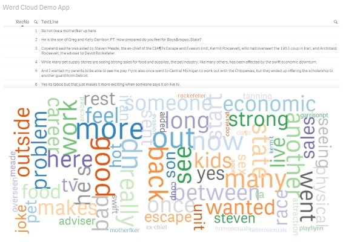

# br.com.clever.wordcloud
Qlik Sense Word Cloud extension
This extension intends to cover the need of including word clouds into Qlik Sense

Modifications by JaniKarh:

1. Reads external data source (txt/csv) with any text (edit file link in *Data load editor*).
2. Removes uninteresting characters from text `,.:;"!?0123456789` with **purgechar**.
3. New demo app, **My Demo App.qvf**.

Notes:

- Tested and created on Qlik Sense Desktop 2.0.1
- My working directory (for data source) is `c:\Devs\Projects\qlik-wordcloud`
- Yes, there are Finnish terms in the data load script, instead of the usual English. You should start learning, it's fun and most useful :) 

Attribution: Sample data courtesy of [Leipzig Corpora Collection](http://corpora2.informatik.uni-leipzig.de/download.html).

